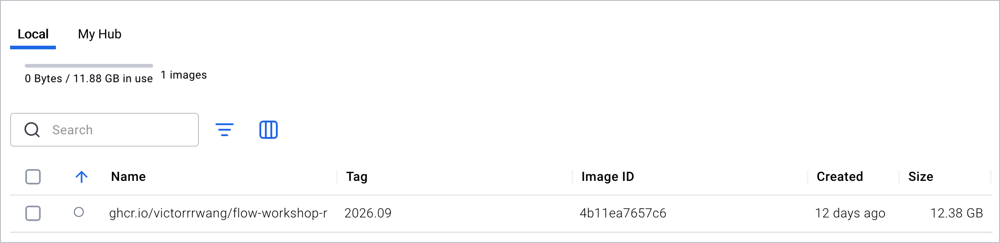

# 工作坊环境配置

**请在工作坊之前在家完成。** 大约十分钟，另加一次下载——不要拖到前一天晚上。这里涉及两样
东西：**软件**（下载约 2 GB，解开后约 13 GB，因此**需要 20 GB 空闲硬盘空间**）和**你的文件夹**
（约 10 MB）。Docker 并不知道你的文件夹在哪里，必须**从该文件夹里面**启动它才行。

# Windows

### 1. 安装 Docker Desktop

打开 [docker.com/products/docker-desktop](https://www.docker.com/products/docker-desktop/)
→ 安装 → 按提示重启 → 启动它。等到系统托盘里的鲸鱼图标不再闪动。

### 2. 下载你的工作坊文件夹

从工作坊邮件里的链接下载 **`flow-workshop-setup.zip`**。
右键点击 → **全部解压缩**（Extract All）→ 解压到 `C:\Users\<你的用户名>\`

最终应该得到文件夹 `C:\Users\<你的用户名>\flow-workshop\`。
**不要**放在"文档"、"桌面"或 OneDrive 里——它们会同步到云端，会把环境弄坏。

### 3. 在该文件夹里打开终端

在文件资源管理器中打开 `flow-workshop` 文件夹 → 点击地址栏 → 输入 `powershell` → 回车。

### 4. 获取软件

**网速好？** 跳过这一步，第 5 步会自动下载。

**用 U 盘：** 你要的文件是 **`FOR-WINDOWS-AND-INTEL-MAC.tar.gz`**
（如果是骁龙 / ARM 笔记本，请改用 `FOR-APPLE-SILICON-MAC.tar.gz`，属于同一类芯片）。

输入 `docker load -i ` —— `i` 后面留一个空格 —— 然后**把该文件从文件资源管理器拖到
PowerShell 窗口里**，路径会自动填好。按回车。**不要手动输入路径。**

接下来几分钟没有进度条，然后会打印
`Loaded image: ghcr.io/victorrrwang/flow-workshop-r:2026.09`。
想确认的话，看 Docker Desktop 的 **Images**——见最后一页。

### 5. 启动容器

```
docker compose up -d
```

**第一次会比较慢。** 命令提示符回来就说明已经在运行了；以后启动只要几秒。

### 6. 验证是否成功

打开 **http://localhost:8787** —— 不需要密码。

在右下角的 **Files** 面板里：`workshop` → `00-check-your-setup.Rmd`。

运行它：点文件上方的 **Knit**（`Ctrl+Shift+K`），或者 **Run > Run All**（`Ctrl+Alt+R`）。
找到以 `SETUP OK` 开头的那一行，**把它回复到工作坊邮件里。**
如果显示的是别的内容，请把全部输出发过来。

### 7. 关闭

`docker compose down` —— 你的文件都还在。之后随时用 `docker compose up -d` 再启动。

\newpage

# macOS

### 1. 安装 Docker Desktop

打开 [docker.com/products/docker-desktop](https://www.docker.com/products/docker-desktop/)
→ 安装 → 从"应用程序"启动。等到菜单栏的鲸鱼图标不再闪动。

然后：**Docker Desktop → Settings → Resources → Memory → 调到 8 GB → Apply & Restart。**
默认值对这个工作坊来说太小了。

### 2. 下载你的工作坊文件夹

从工作坊邮件里的链接下载 **`flow-workshop-setup.zip`**。Safari 通常会自动解压；
否则双击它。

把解压出来的 **`flow-workshop`** 文件夹拖到你的个人文件夹（主目录）里，
最终得到 `/Users/<你的用户名>/flow-workshop/`。
*（在访达里就是那个房子图标的文件夹——看不到的话按 `Shift+Cmd+H`。）*

### 3. 在该文件夹里打开终端

打开**终端**（`Cmd+空格`，输入 `terminal`，回车）。输入 `cd ` —— 后面留一个空格 ——
然后把 `flow-workshop` 文件夹从访达拖到终端窗口里，按回车。

### 4. 获取软件

**网速好？** 跳过这一步，第 5 步会自动下载。

**用 U 盘：** 用哪个文件取决于你的 Mac。苹果菜单 → **关于本机**：
显示"芯片：Apple M1/M2/M3/M4"的用 **`FOR-APPLE-SILICON-MAC.tar.gz`**；
显示"处理器：Intel"的用 **`FOR-WINDOWS-AND-INTEL-MAC.tar.gz`**。

输入 `docker load -i ` —— `i` 后面留一个空格 —— 然后**把该文件从访达拖到终端窗口里**，
路径会自动填好。按回车。**不要手动输入路径。**

接下来几分钟没有进度条，然后会打印
`Loaded image: ghcr.io/victorrrwang/flow-workshop-r:2026.09`。
想确认的话，看 Docker Desktop 的 **Images**——见最后一页。

### 5. 启动容器

```
docker compose up -d
```

**第一次会比较慢。** 命令提示符回来就说明已经在运行了；以后启动只要几秒。

### 6. 验证是否成功

和 Windows 第 6 步一样——打开 **http://localhost:8787**，在 **Files** 面板里运行
`workshop/00-check-your-setup.Rmd`——只是快捷键换成 `Cmd+Shift+K`（Knit）和
`Cmd+Option+R`（Run All）。**把 `SETUP OK` 那一行回复到工作坊邮件里**，
如果显示的是别的内容，请把全部输出发过来。

### 7. 关闭

`docker compose down` —— 你的文件都还在。之后随时用 `docker compose up -d` 再启动。

\newpage

# 第 4 步成功了吗？

打开 Docker Desktop，点左侧的 **Images**。你要找的是这样一行：
名称 `ghcr.io/victorrrwang/flow-workshop-r`，标签 `2026.09`，大小约 12 GB：

{width=100%}

只要这一行在，软件就已经装到你的机器上了，可以直接进入第 5 步——终端里滚过什么都不要紧。

如果列表是**空的**，说明 `docker load` 没有完成。常见原因：

- **硬盘空间不够。** 这个文件解开后约 13 GB。清理出空间后重新运行。
- **路径是手动输入的。** 请改成把文件拖到终端窗口里。
- **Docker Desktop 没有在运行。** 启动它，等鲸鱼图标稳定下来，再试一次。

重新运行是安全的——不会损坏任何东西，也不会占用双倍空间。

---

*卡住了？请回复工作坊邮件，并附上终端显示内容的截图。请不要拖到当天早上。*
